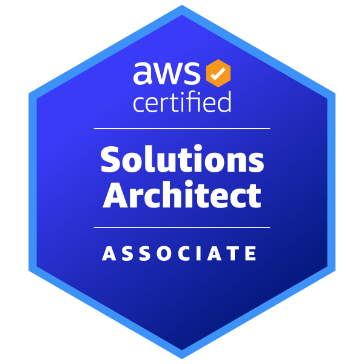
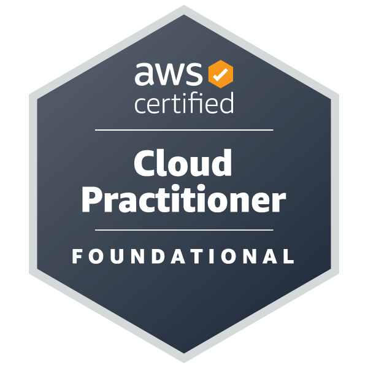
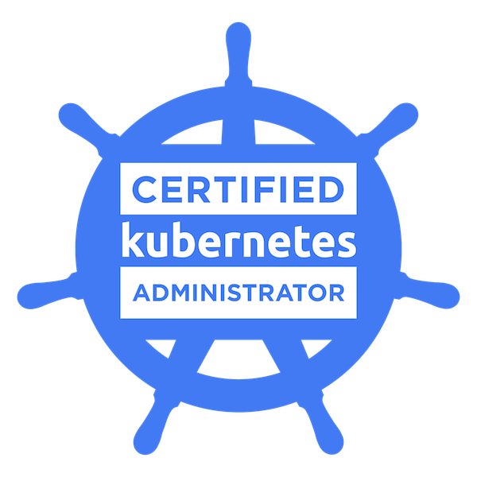
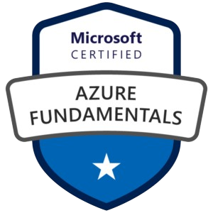
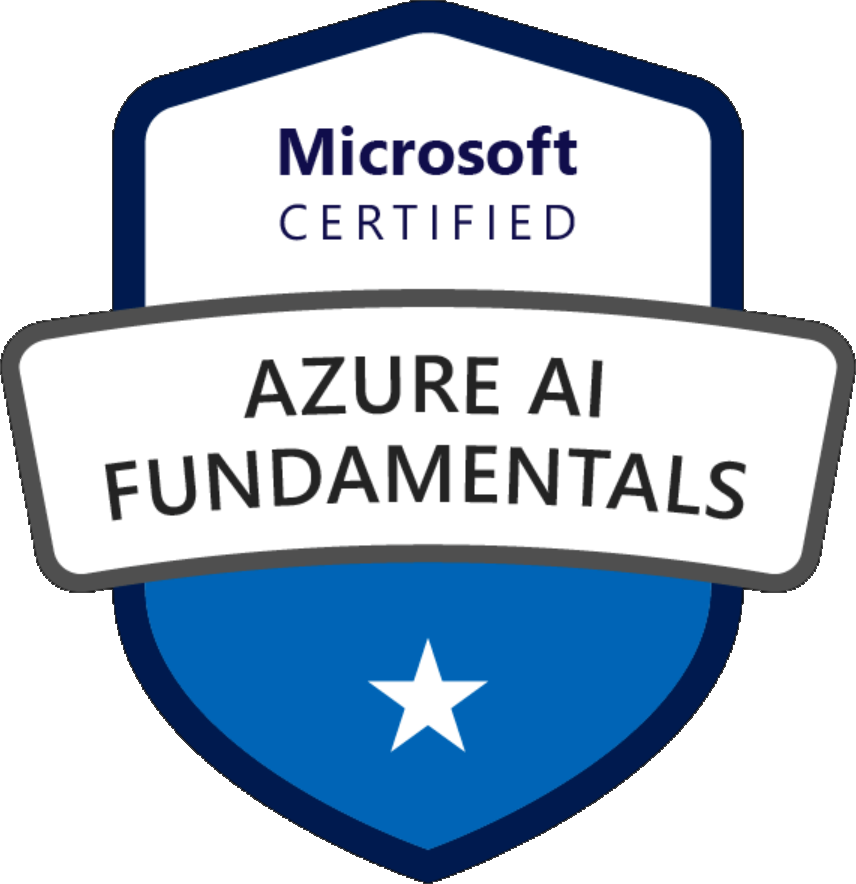
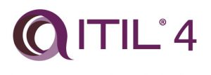
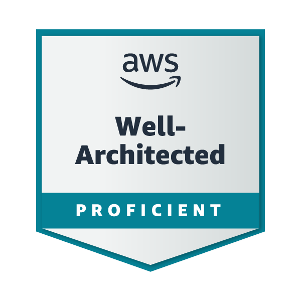

# 💻 Evaristo R. Rivieccio Vega

## 👨‍💻 About Me

Specialist in AWS, Linux system administration and automation with Python and Shell Scripting.
With more than 6 years of experience, I focus on optimizing infrastructures, managing Linux and Windows servers, and improving processes through scripting and DevOps tools.

---

## 🚀 Technologies Used

## 📜 Certifications
Passionate about continuous learning, I have multiple certifications in cloud, system administration and service management:

| Certification | Logo |
|--------------|------|
| AWS Certified Solutions Architect - Professional |  |
| AWS Certified Solutions Architect – Associate |  |
| AWS Certified Cloud Practitioner |  |
| Certified Kubernetes Administrator (CKA) |  |
| Microsoft AZ-900 Certified Azure Fundamentals |  |
| Microsoft AZ-104 Certified Azure Administrator Associate |  |
| Microsoft AI-900 Certified Azure AI Fundamentals |  |
| LPIC-1 - Linux Administrator |  |
| ITIL 4 |  |
| AWS Well-Architected Proficient |  |

---

## 📫 Contact

    
